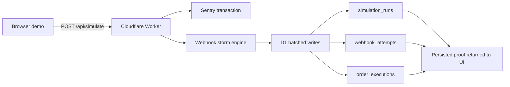

# RevenueGuard

> One payment. Twenty webhook deliveries. Exactly one order.

[](https://revenueguard.otienomkeith.workers.dev/)
[](https://dev.to/bugsmash)
[](LICENSE)


RevenueGuard is a live payment-webhook chaos lab. It reproduces a costly idempotency bug, stores the evidence in Cloudflare D1, and demonstrates the database-enforced fix side by side.

Built for **DEV's Summer Bug Smash 2026 — Clear the Lineup**, with instrumentation for the **Best Use of Sentry** category and a documented Gemini-assisted debugging workflow.

## Judge quick start

1. Open the [live demo](https://revenueguard.otienomkeith.workers.dev/).
2. Run **Vulnerable**: one payment produces seven orders and exposes `$894` of duplicate revenue risk.
3. Select **Apply database fix**.
4. Run **Protected**: the same 20 deliveries produce one order; 19 duplicates are blocked.
5. Review the persisted event stream and trace waterfall.

No account, payment method, or seeded test data is required.

## The bug we smashed

The first backend implementation attempted to insert all 20 webhook attempts in one D1 statement. The statement exceeded D1's bound-parameter limit, so the main demo path failed precisely when it tried to reproduce the event storm.

The initial reliability fix chunks webhook attempts into groups of ten. The performance follow-up executes the run, attempt chunks, and order writes in a single D1 batch, reducing remote database round trips while preserving the safe parameter count.

| Before | After |
| --- | --- |
| 20-attempt bulk insert could exceed D1's parameter ceiling | Inserts stay below the ceiling in deterministic chunks |
| Multiple sequential database round trips | One atomic D1 batch plus one verification read |
| Demo could fail during the headline scenario | Both vulnerable and protected flows persist reliably |
| Limited keyboard and status semantics | Visible focus, pressed state, busy state, and larger touch targets |

See [the technical bug report](docs/BUGSMASH.md) for the root cause, fix, validation, and judging evidence.

## Architecture



## Sentry instrumentation

RevenueGuard uses `@sentry/cloudflare` at the Worker boundary and adds custom telemetry around the critical money path:

- automatic Worker error capture;
- a `db.d1.batch` span around the persistence operation;
- mode, event-count, and order-count span attributes;
- structured completion logs with duplicates blocked and revenue at risk;
- explicit exception capture for failed simulations;
- privacy-first defaults with personally identifiable information disabled.

Set `SENTRY_DSN` in the deployment environment to send traces, logs, and errors to your Sentry project. The application remains functional when the variable is absent.

## Gemini-assisted debugging

Gemini was used as an adversarial test designer: it proposed duplicate, concurrent, delayed-acknowledgement, and out-of-order schedules. Those suggestions were converted into deterministic fixtures so the result is reproducible for every judge.

The prompt, output contract, and engineering decisions are recorded in [docs/GEMINI_ADVERSARY.md](docs/GEMINI_ADVERSARY.md).

## Technology

- React 19 and TypeScript
- vinext/Vite on Cloudflare Workers
- Cloudflare D1
- Drizzle ORM
- Sentry Cloudflare SDK
- Node's built-in test runner and ESLint

## Run locally

Requirements: Node.js `>=22.13.0`.

```bash
npm install
npm run dev
```

Then open the local URL printed by vinext. D1 is simulated locally through the Cloudflare Vite plugin.

### Optional Sentry configuration

```bash
cp .env.example .env.local
```

Add your public Sentry DSN to `.env.local`. Never commit credentials or auth tokens.

## Validation

```bash
npm run lint
npm test
npm audit --omit=dev
```

The deployed build is additionally checked at desktop and mobile widths. Both backend modes are exercised against the production D1 database before release.

## Repository map

```text
app/                  UI and API routes
db/                   D1 schema and Drizzle client
drizzle/              database migration
worker/               Cloudflare entry point and Sentry boundary
tests/                rendered-page regression tests
docs/                  hackathon evidence and AI workflow
public/                social preview and brand assets
```

## Security and cost

- The demo uses generated references rather than real payment or customer data.
- Sentry PII collection is disabled.
- Secrets belong in deployment environment variables and ignored local `.env` files.
- The demo fits within free development tiers for Cloudflare, D1, Sentry, and Gemini during hackathon evaluation.

## License

[MIT](LICENSE) © 2026 Keith Otieno
