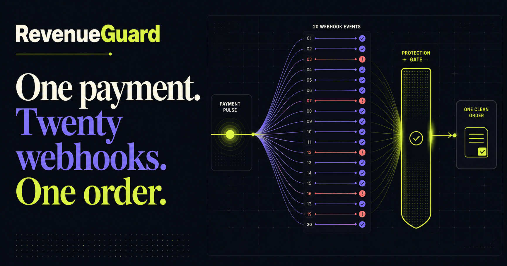
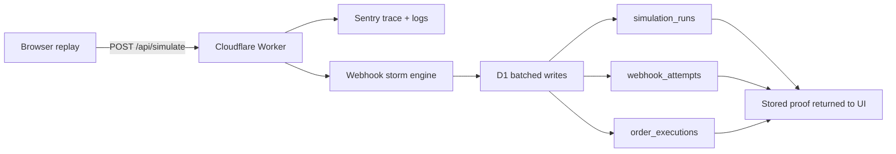

# RevenueGuard

> One payment. Twenty webhook deliveries. Exactly one order.

[](https://revenueguard.otienomkeith.workers.dev)
[](https://dev.to/bugsmash)
[](LICENSE)



RevenueGuard is a working payment-webhook replay lab. It reproduces a duplicate-order race, stores the evidence in Cloudflare D1, and proves the idempotency fix using the same 20-event input.

Built for **DEV's Summer Bug Smash 2026 — Clear the Lineup**, with production instrumentation for the **Best Use of Sentry** category.

## Try it

1. Open the [live Cloudflare deployment](https://revenueguard.otienomkeith.workers.dev).
2. Run **Vulnerable**: one payment creates multiple orders.
3. Select **Apply fix**.
4. Run **Protected**: the same 20 deliveries create exactly one order and block 19 duplicates.

No sign-in, payment method, or seeded data is required.

## What is real

- Every run calls a deployed Cloudflare Worker API route.
- Every event storm is persisted to a production D1 database.
- The vulnerable and protected paths use the same deterministic input.
- `@sentry/cloudflare` captures errors, traces the D1 batch, and emits structured completion logs.
- The public repository includes the migration, regression tests, and [bug-fix evidence](docs/BUGSMASH.md).

## Architecture



## Sentry evidence

The Worker is wrapped with `Sentry.withSentry` and the money path adds:

- a `db.d1.batch` span;
- run mode, event count, and order count attributes;
- structured logs for orders, blocked duplicates, and revenue at risk;
- explicit exception capture;
- PII collection disabled.

The production DSN is stored as a Cloudflare secret and is never committed.

## Technology

- React 19 and TypeScript
- vinext and Vite
- Cloudflare Workers and D1
- Drizzle ORM
- Sentry Cloudflare SDK
- Wrangler-generated runtime types

## Local development

Requires Node.js `>=22.13.0`.

```bash
npm install
npm run dev
```

D1 is simulated locally by the Cloudflare Vite plugin.

## Validate

```bash
npm run lint
npm test
npm audit --omit=dev
```

## Deploy to Cloudflare

After authenticating Wrangler, create a D1 database, update its ID in `wrangler.jsonc`, then run:

```bash
npm run cf:types
npm run db:migrate:remote
npx wrangler secret put SENTRY_DSN
npm run deploy
```

The deployed project uses Cloudflare Workers hosting—not ChatGPT Sites.

## Repository map

```text
app/                        interface and API routes
db/                         D1 schema and Drizzle client
drizzle/                    database migration
worker/                     Cloudflare entry and Sentry boundary
worker-configuration.d.ts   generated Cloudflare runtime types
tests/                      rendered-page regression tests
docs/                       hackathon evidence
wrangler.jsonc              production Worker and D1 configuration
```

## License

[MIT](LICENSE) © 2026 Keith Otieno
