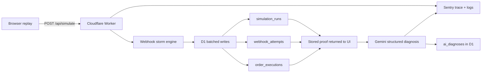

# RevenueGuard

> One payment. Twenty webhook deliveries. Exactly one order.

[](https://revenueguard.otienomkeith.workers.dev)
[](https://dev.to/bugsmash)
[](LICENSE)


RevenueGuard is a working payment-webhook replay lab. It reproduces a duplicate-order race, stores the evidence in Cloudflare D1, and proves the idempotency fix using the same 20-event input. Gemini then diagnoses the persisted run and proposes the next adversarial test.

Built for **DEV's Summer Bug Smash 2026 — Clear the Lineup**, with production integrations for the **Best Use of Sentry** and **Best Use of Google AI** categories.

## Try it

1. Open the [live Cloudflare deployment](https://revenueguard.otienomkeith.workers.dev).
2. Run **Vulnerable**: one payment creates multiple orders.
3. Read Gemini's diagnosis of the stored evidence.
4. Select **Apply fix**.
5. Run **Protected**: the same 20 deliveries create exactly one order and block 19 duplicates.

No sign-in, payment method, or seeded data is required.

## What is real

- Every run calls a deployed Cloudflare Worker API route.
- Every event storm is persisted to a production D1 database.
- The vulnerable and protected paths use the same deterministic input.
- `@sentry/cloudflare` captures errors, traces the D1 batch, and emits structured completion logs.
- Gemini 3.5 Flash-Lite analyzes the server-fetched D1 record, returns schema-constrained JSON, and saves its diagnosis and traceable request reference back to D1.
- The Gemini request is a traced Sentry span, linking AI latency and errors to the replay that caused them.
- The public repository includes the migration, regression tests, and [bug-fix evidence](docs/BUGSMASH.md).

## Architecture



## Google AI evidence

After every replay, `/api/analyze` accepts only the stored run ID. The Worker—not the browser—loads the run, attempts, and order executions from D1 and sends that bounded evidence to the Gemini Interactions API. Gemini returns a strict diagnosis containing a verdict, root cause, cited evidence, recommended fix, next adversarial test, and confidence score.

The response is validated before it is persisted. AI remains advisory: the D1 uniqueness constraint, not the model, is the authority for payment execution. See [the runtime AI design](docs/GEMINI_ADVERSARY.md).

Saved diagnoses are served from D1 without another model call. A Cloudflare Rate Limiting binding caps new Gemini diagnoses at 10 per minute per Cloudflare location, protecting the free quota without adding sign-in to the judge experience.

## Sentry evidence

The Worker is wrapped with `Sentry.withSentry` and the critical path adds:

- a `db.d1.batch` span for the webhook storm;
- an `ai.gemini.interactions` span for the diagnosis;
- run mode, event count, model, verdict, token, and latency attributes;
- structured logs for orders, blocked duplicates, revenue at risk, and saved AI diagnoses;
- explicit exception capture;
- PII collection disabled.

The production DSN and Gemini API key are stored as Cloudflare secrets and are never committed.

## Technology

- React 19 and TypeScript
- vinext and Vite
- Cloudflare Workers and D1
- Drizzle ORM
- Sentry Cloudflare SDK
- Google Gemini Interactions API
- Wrangler-generated runtime types

## Local development

Requires Node.js `>=22.13.0`.

```bash
npm install
npm run dev
```

D1 is simulated locally by the Cloudflare Vite plugin. Add development secrets to an ignored `.dev.vars` file.

## Validate

```bash
npm run lint
npm test
npm audit --omit=dev
```

## Deploy to Cloudflare

After authenticating Wrangler, create a D1 database, update its ID in `wrangler.jsonc`, then run:

```bash
npm run cf:types
npm run db:migrate:remote
npx wrangler secret put SENTRY_DSN
npx wrangler secret put GEMINI_API_KEY
npm run deploy
```

The deployed project uses Cloudflare Workers hosting—not legacy preview hosting. The selected Gemini 3.5 Flash-Lite model has a free tier; RevenueGuard makes one short analysis request per new run and caches the saved result in D1.

## Repository map

```text
app/                        interface and API routes
db/                         D1 schema and Drizzle client
drizzle/                    database migrations
worker/                     Cloudflare entry and Sentry boundary
worker-configuration.d.ts   generated Cloudflare runtime types
tests/                      rendered-page regression tests
docs/                       hackathon evidence
wrangler.jsonc              production Worker and D1 configuration
```

## License

[MIT](LICENSE) © 2026 Keith Otieno
